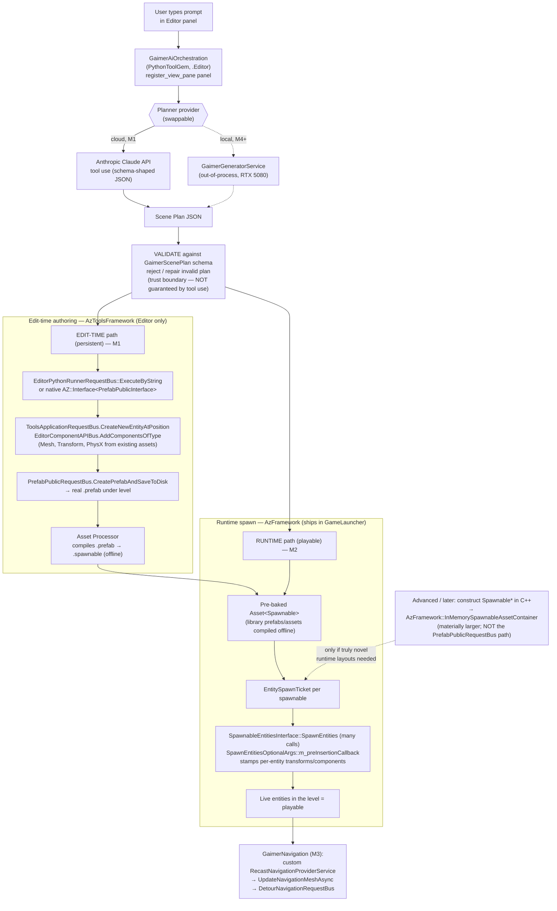

> **Decision status (2026-09-13).** Phase 2 is formally **OPEN**. Decisions recorded against §9:
> **#1 Inference posture → HYBRID** (decided). **#4 Repo identity → RESOLVED** — the canonical repo is `coolm4ttman/gaimer` (the full fork, renamed from `coolm4ttman/o3de` on 2026-07-13); the stale remote line in `upstream-sync.md` is fixed, so §9-4's "unresolved" note is superseded. **#8 → decided: M0 authorized.** Decisions #2, #3, #5, #6, #7 gate M4+ and remain open until local-ML work begins.
# GAIMER Phase 2 Plan — AI-Native World Generation Layer

**Status:** FINAL for user decision · **Baseline:** O3DE fork @ `gaimer-main` (engine 2605.0 / v2.6.0) · **Golden rule:** every GAIMER capability ships as a separable Gem/overlay/config; zero O3DE core-source edits (any unavoidable touch is minimal, header-marked "modified from O3DE," and logged in `GAIMER\docs\upstream-sync.md`).

> **Grounding & honesty note.** This plan is built from *reading* O3DE source at this checkout. **Nothing here has been compiled, and `o3de.bat` has never been executed.** API names, CMake behavior, and gem-registration mechanics are inferences pinned to this checkout — treated as provisional until a build proves them (see §6 M0 and §9). Where the source review found a hard error in the earlier draft, it is corrected below and called out. Where tooling or licensing is unverified, it is stated as risk, not fact.

---

## 1. Executive summary

GAIMER Phase 2 turns a natural-language prompt into a playable world, but the first slice deliberately proves the *authoring seam* — prompt → validated scene plan → a real, saved `.prefab` — before touching any local ML, 3D synthesis, or the north-star "playable" verb. All AI capability ships as new, separable Gems physically isolated under `GAIMER\Gems\`, registered through a GAIMER-owned project so upstream O3DE merges stay clean, with every heavy ML dependency held out-of-process in a sidecar. The recommended inference posture is a **cloud-first hybrid**: Anthropic Claude as the planner brain now, with a swappable local backend deferred until the RTX 5080 / Blackwell (sm_120) toolchain is proven off the critical path. A source-level adversarial review corrected one blocking technical error (the runtime spawn path named an editor-only API), added a mandatory **M0 build-proof gate**, and de-risked the Blackwell and VRAM assumptions — all incorporated here. This document ends with a concrete first-gem spec ready to scaffold on approval and a numbered list of decisions only the user can make.

---

## 2. Phase 2 goal & bounded scope

**North star:** natural-language prompt → *playable* world. That is far too large for one slice. The first slice proves the **seam**, not the generative frontier, and does not reach the north-star verb "playable" — it reaches **persisted, authored content**. Playability arrives one milestone later.

### IN (first valuable slice — M1)
- A **prompt-driven, dockable Editor panel** that turns a natural-language prompt into a **structured, versioned JSON scene plan**.
- **Cloud LLM orchestration** (Anthropic Claude API, via **tool use** — see §4/§L-notes) as the planner brain — no local ML toolchain required to ship.
- A **validation/repair trust boundary**: the plan is validated against a versioned JSON Schema before anything touches the world.
- **Placement of already-existing content** (engine primitives + assets already in the project's library) into the current level through the O3DE Prefab authoring seams, producing a **real, saved `.prefab`** that is persistent and shippable.
- The schema lives as **JSON Schema + Python validation inside the single PythonToolGem** — M1 is genuinely Python-only, no C++ compile beyond the gem's thin shell.

### OUT (first slice — deferred or rejected)
- **Runtime / in-game spawning** — deferred to M2 (this is where "playable" first arrives).
- **A C++/BehaviorContext-reflected schema gem** — deferred to M2, the first milestone with an actual runtime reader. Reflecting it at M1 buys nothing M1 uses and drags in the unverified C++ build.
- **Local GPU inference** of any model — deferred to M4.
- **Generative 3D mesh synthesis** (TRELLIS / NuiScene) — deferred to M5–M6; first slices reuse existing assets only.
- **Runtime procedural mesh building** (Atom `MeshFeatureProcessorInterface::AcquireMesh`) and **on-the-fly shaders/materials** — out; generated content reuses **already-compiled** assets and materials (new shaders need offline AZSLc+DXC via the Asset Processor).
- **Navmesh / agent behavior** (Recast) — additive at M3, not first.
- **Motion/animation generation** (MotionBricks) — rejected for Phase 2 (§5).
- **Agentic multi-model scene sim** (SAGE / Isaac Sim) — rejected as a dependency (§5); only its agent+critic *pattern* is mined.
- **Shipping model weights or a CUDA runtime inside the distributed product** — a licensing decision deferred until a specific model and a distribution model are chosen (§4 M7, §6, §9).
- **Dynamic crowd avoidance** — the shipped Recast gem has no Detour Crowd; explicitly not provided.

---

## 3. Architecture — Gem breakdown

All Gems live under `C:\Users\Matt\gaimer\o3de\GAIMER\Gems\<GemName>\` — a **greenfield folder** (`GAIMER\` today holds only `branding\` and `docs\`), so they add **zero conflict surface** against the upstream `Gems\` tree.

**Registration home (separability decision).** Register the Gems as external subdirectories of a **new GAIMER-owned project** (e.g. `GAIMER\Projects\GaimerSandbox`) whose `project.json` carries them in `external_subdirectories` + `gem_names`. This keeps *all* gem wiring in a GAIMER-owned file and **avoids appending to the upstream-tracked `engine.json`**. **Honest caveat (L10):** this is not fully self-contained — for the engine to *find and build* the project, the project itself must be registered in the **user-scope `o3de_manifest.json` `projects` array**, one touch **outside** `GAIMER\`. That is user-scope config, not repo source, but it is a real out-of-repo step to expect at M0. If an `engine.json` append ever proves unavoidable, it must be an array-append only and logged in the core-edit register (which today holds 7 asset swaps and **zero source edits** — a posture we preserve).

| Gem | Responsibility | On-disk location | Language / template | Load variant | How it stays separable |
|---|---|---|---|---|---|
| **GaimerAiOrchestration** | Editor "brain-facing" tool: dockable prompt panel, calls the Planner provider, receives a scene plan, **validates/repairs it against the JSON Schema**, then drives edit-time placement. First slice's centerpiece. **In M1 it also owns the schema (as JSON Schema + Python validation) — no separate schema gem yet.** | `GAIMER\Gems\GaimerAiOrchestration` | **PythonToolGem** (thin C++ shell + Python UI under `Editor/Scripts/`, `bootstrap.py` → `az_qt_helpers.register_view_pane`). Fastest to iterate. | `.Editor` / `.Tools` only | Editor-only; depends on `EditorPythonBindings` + `QtForPython`. No core edits. |
| **GaimerScenePlan** *(M2+)* | The **versioned scene/asset-plan schema** reflected to BehaviorContext so Python **and the runtime** read one contract. Introduced only when a runtime reader exists. | `GAIMER\Gems\GaimerScenePlan` | **DefaultGem** (C++, small; reflected to BehaviorContext) | `.Clients` + `.Editor` | Pure data + reflection; depended on by the others. |
| **GaimerRuntimeSpawner** *(M2)* | Runtime, in-game execution of a scene plan by **composing pre-baked `.spawnable` assets** into live entities via the AzFramework Spawnable path. The only path usable in the GameLauncher. Proves "playable." | `GAIMER\Gems\GaimerRuntimeSpawner` | **DefaultGem** (C++ runtime SystemComponent) | `.Clients` / `.Servers` / `.Unified` | Runtime-context only; **no AzToolsFramework dependency**. |
| **GaimerAssetIngest** *(M5+)* | Registers an asset builder to ingest generator output (GLB/glTF/FBX, or an intermediate plan format), with an OBJ→glTF step where needed, feeding the Asset Processor. | `GAIMER\Gems\GaimerAssetIngest` | **DefaultGem** builder module, or **PythonAssetBuilder**-based | `.Builders` | Asset-time only via `AssetBuilderBus::RegisterBuilderInformation`. |
| **GaimerNavigation** *(M3)* | A custom Recast geometry **provider** advertising `RecastNavigationProviderService`, feeding generated geometry into navmesh build, plus rebuild triggering. | `GAIMER\Gems\GaimerNavigation` | **DefaultGem** (C++), `dependencies:["RecastNavigation"]` | `.Clients` + `.Editor` | Uses the documented provider extension seam; no core edits. |
| **GaimerBehaviorNodes** *(optional, later)* | Exposes GAIMER spawn/plan operations as ScriptCanvas nodes for designers. | inside `GaimerRuntimeSpawner\Code\Source\<Nodes>` | **ScriptCanvasNode** *fragment* added to an existing gem, `dependencies:["ScriptCanvas"]` | follows host gem | Fragment, not a standalone gem; multi-step create-from-template + re-register. |

**Not a Gem — the sidecar.** `GaimerGeneratorService` is an **out-of-process** Python service (localhost HTTP/IPC) that hosts any local model (later: a local planner LLM, TRELLIS). Gems talk to it — and to the cloud — over the network only. **Two claims that must not be conflated (M7):** out-of-process delivers **git/merge cleanliness** (no CUDA/PyTorch in the engine process, so upstream O3DE merges stay clean). It delivers **nothing** for licensing — if the sidecar is *distributed with the product*, its bundled `torch` + CUDA/cuDNN runtime carry NVIDIA redistribution terms regardless of process boundary. Whether the sidecar is **distributed** or **user-installed-locally** is an open decision (§9) that flips whether those redistributables need auditing at all. **Security (L11):** the sidecar must bind to loopback only and require a local token — an unauthenticated localhost inference endpoint is reachable by any local process; state this as a decision, not an omission, before it ever touches user data or the filesystem.

**Why this split honors the golden rule.** Editor-side AI (panels, planning, edit-time placement) lives in `.Editor` modules; runtime AI in `.Clients` modules; asset ingest in `.Builders`; heavy ML entirely outside the engine. The clean O3DE `Clients/Servers/Tools/Builders` alias split is exactly the boundary we exploit.

### End-to-end data flow: prompt → playable content

> **Correction incorporated (C1).** The earlier draft's runtime path named `PrefabPublicRequestBus::CreateInMemorySpawnableAsset`. That API lives in **`AzToolsFramework`** (`Prefab/PrefabPublicRequestBus.h`), takes a **prefab file path**, and runs the tools-side prefab→spawnable pipeline — **none of which exists in a shipped GameLauncher**. The runtime `AzFramework::InMemorySpawnableAssetContainer` has a *different* contract: it requires an **already-built `Spawnable*`/product data** and re-wraps it (its header describes a server receiving in-memory spawnable data from a client). It does **not** convert a prefab or an LLM plan at runtime. The runtime path below therefore **composes pre-baked `.spawnable` assets** — the honest, supported path.



**Prose walkthrough (real O3DE seams named — all provisional until M0):**

1. **Prompt intake.** User types into a dockable panel added by `GaimerAiOrchestration`'s `bootstrap.py` via `az_qt_helpers.register_view_pane`. Editor-only, Python-authored.
2. **Planning.** The panel calls the **Planner provider**. In M1 that provider is the Claude API using **tool use** — the model calls a tool whose input schema you define, yielding shape-constrained JSON (this is Anthropic's mechanism; there is no OpenAI-style "structured outputs" mode — L8). In M4+ the same interface points at the local sidecar.
3. **Validation (trust boundary — L8).** Tool-use JSON is shaped by the tool schema you hand Claude, but it is **not** validated against the versioned `GaimerScenePlan` schema and is not guaranteed conformant. The validate/reject/repair layer is genuinely necessary and must be designed against tool-use JSON — do not drop it on the assumption the model already guarantees conformance.
4. **Edit-time placement (persistent, M1).** Executed as generated Python through `AzToolsFramework::EditorPythonRunnerRequestBus::ExecuteByString`, or natively via `AZ::Interface<PrefabPublicInterface>`. Entities created with `ToolsApplicationRequestBus` `CreateNewEntityAtPosition`, components (Mesh/Transform/PhysX) referencing **already-compiled library assets** attached via `EditorComponentAPIBus` `AddComponentsOfType`, parented under `GetLevelInstanceContainerEntityId()`, then persisted with `PrefabPublicRequestBus.CreatePrefabAndSaveToDisk`. The Asset Processor compiles the `.prefab` → `.spawnable` offline. **(L9: every one of these API names is a read-only inference on a checkout whose prefab APIs carry deprecation notices — pin signatures by string at M0, expect drift on upstream sync.)**
5. **Runtime spawn (playable, M2).** `GaimerRuntimeSpawner` loads the **pre-baked `Asset<Spawnable>`** for each library asset, builds an `EntitySpawnTicket` per spawnable, and issues many `SpawnableEntitiesInterface::SpawnEntities` calls, using `SpawnEntitiesOptionalArgs::m_preInsertionCallback` to stamp per-entity transforms/components before entities enter the world — **assembling a scene from existing spawnables**, not converting a novel prefab at runtime. `SpawnableScriptMediator` is the Lua/ScriptCanvas shortcut. Lifetime is caller-owned: dropping the ticket despawns. **Only if truly novel runtime layouts are required** does the alternative apply — construct a `Spawnable*` programmatically in C++ and hand it to `AzFramework::InMemorySpawnableAssetContainer` — a materially larger task, explicitly *not* the editor `PrefabPublicRequestBus` path.
6. **Navigation (M3, additive).** `GaimerNavigation` supplies a custom provider (`CollectGeometry`/`CollectGeometryAsync` filling `TileGeometry` — indexed triangle soup, `RecastVector3::CreateFromVector3SwapYZ` for the Z-up→Y-up swap), triggers `RecastNavigationMeshRequestBus::UpdateNavigationMeshAsync`; agents path via `DetourNavigationRequestBus::FindPathBetweenPositions`.

**Two surfaces, never conflated:** edit-time Prefab/`azlmbr` APIs are AzToolsFramework/Editor-context only and do not exist in a shipped GameLauncher; anything in-game uses the AzFramework Spawnable path exclusively.

---

## 4. Inference architecture — an explicit user decision

### Recommendation: **cloud-first hybrid**

Lead with **cloud orchestration**; make **generation a swappable per-asset backend**.

- **Planner = Anthropic Claude API (tool use).** Turns the prompt into a validated JSON scene plan; most capable option, **no local ML toolchain to ship**, defers all Blackwell/CUDA pain out of the critical path. Prompt-caching the stable system/tool prefix cuts repeat cost. *(Per-call cost figures are illustrative arithmetic, not benchmarked on real GAIMER prompts.)*
- **Generator = provider interface.** Asset generation sits behind a `Generator` abstraction (cloud API *or* local sidecar), so local RTX-5080 generation lands incrementally without redesign.
- **Everything ML runs out-of-process** in `GaimerGeneratorService` (loopback + token — L11), keeping the engine process CUDA-free and upstream merges clean.

### The tradeoff — framed as your decision

| Axis | Cloud-only | Local-only (RTX 5080) | **Hybrid (recommended)** |
|---|---|---|---|
| Planning quality | Frontier (best) | ~14B quantized = materially weaker | Frontier now, local fallback later |
| Speed to first demo | Fastest | Slowest (toolchain setup) | Fast |
| Offline | **None** — always online | Full offline | Cloud online; optional local fallback |
| Marginal cost | Per-call API cost | Zero after setup | Per-call now, trends to zero |
| Privacy / data egress | Prompts leave device | Full data control | Configurable per provider |
| Ceiling / maintenance | No local ceiling | 16 GB VRAM ceiling + sm_120 upkeep | Pay only when you add local |
| Build/maintenance cost | Lowest | Highest | Middle (must maintain the provider seam) |

**Choose CLOUD-ONLY** if speed-to-demo and max quality dominate and always-online + per-call cost + off-device prompts are acceptable. **Choose LOCAL-ONLY** if privacy/offline/zero-marginal-cost dominate and you accept weaker planning, the 16 GB ceiling, and Blackwell maintenance. **Choose HYBRID** for cloud-quality planning now with a path to local generation and an offline fallback, at the cost of building and maintaining the provider seam. **My recommendation: hybrid.** (This is a genuine product decision on privacy, connectivity, and unit economics — it is yours to make; see §9 Decision 1.)

### RTX 5080 implications (Blackwell sm_120, 16 GB) — verified live, with corrected specifics

- **What works today.** GPU inference is confirmed working **only** inside `C:\Users\Matt\PersonaPlex\venv` (`torch 2.11.0+cu130`, sm_120 confirmed by a live matmul). System Python torch is CPU-only. No CUDA toolkit/nvcc, no Ollama/llama.cpp/LM Studio, no TensorRT.
- **Toolkit/runtime version — corrected (M4).** The working venv is **CUDA 13.0 (cu130)**, not 12.8. Custom CUDA extensions (TRELLIS/NuiScene) are built by `nvcc` against torch's CUDA major. Installing a **12.8** toolkit against a **cu130** torch will produce extensions that fail to load. **Pick one and state it:** either install a **CUDA 13.0** toolkit to match the current venv, **or** downgrade torch to a **cu128** build and install **12.8** — do not mix majors.
- **Nightly fragility — corrected (M4).** `torch 2.11.0+cu130` is well ahead of the stable line and is almost certainly a nightly/pre-release. A single `pip install` resync can pull a wheel that drops sm_120 or the cu130 build, silently breaking the only confirmed GPU path. **Freeze it now:** `pip freeze` + archive the exact wheels (torch + any built extensions) to a local wheelhouse and treat that snapshot as the pinned dependency for M4/M5. Do not depend on a live index for a nightly.
- **Concurrent VRAM — corrected (M5).** The 16 GB card is **not** all available to the model. The marquee workflow runs the **O3DE Editor (Atom renderer) + Windows desktop compositor** co-resident on the same 5080 — realistically 2–4 GB — leaving an **effective ~12–13 GB** model budget. Budget against **Editor-open headroom**, not an idle card: run the sidecar with explicit VRAM caps, offload to CPU/disk when the Editor is foregrounded, or run the sidecar on a second machine behind the same localhost abstraction. 16 GB idle "comfortably runs 7B–14B + SDXL/quantized FLUX"; **~12–13 GB concurrent turns a 16 GB-floor model into an overflow.**

---

## 5. Generation-tech verdicts

| Tech | Verdict | Reasoning |
|---|---|---|
| **Recast / Detour** (O3DE `RecastNavigation` gem) | **ADOPT** (M3) | Already in the repo, first-party, license `Apache-2.0 OR MIT` + zlib (clean). Documented **custom-provider seam** (`RecastNavigationProviderService`) feeds AI-generated geometry with **zero core edits**; `TileGeometry` is exactly the triangle-soup our generators emit. **CPU-only → RTX 5080 irrelevant, no toolchain risk.** Caveat: no Detour Crowd / dynamic avoidance — scoped out. |
| **Microsoft TRELLIS** (text/image → 3D) | **DEFER → adopt** (M5) | Best fit for single-asset "prompt → mesh." **MIT code + weights** (commercially viable); GLB export ingests via O3DE Scene Processing (AssImp; glTF/GLB supported, FBX most mature). Runs out-of-process → golden-rule clean. **Blockers:** v1's 16 GB is a **floor, not comfortable** — and with the Editor co-resident (~12–13 GB effective, §4) it is likely an **overflow**; pinned PyTorch 2.4/CUDA 11.8 **predate sm_120** — needs a rebuild against the pinned cu130 (or cu128) venv, custom CUDA extensions recompiled, **no confirmed 5080 run**; TRELLIS.2-4B (24 GB) won't fit. Output is **not game-ready** (retopo/UVs/LODs/colliders needed). **License tail:** audit `nvdiffrast`/`diffoctreerast`/Flexicubes before shipping. |
| **NuiScene** (unbounded outdoor scene gen) | **DEFER** (M6, optional) | **MIT code**; inference fits comfortably (ran on an 11 GB 2080 Ti). But **minutes-latency offline bake**, **geometry-only** (no textures/materials/UVs/collision/semantics), narrow style (43 training scenes), emits `.obj` (needs conversion), same Blackwell/torch-cluster rebuild friction. Good as a *bake-a-terrain* tool feeding `GaimerAssetIngest`; poor for interactive gen. **Inference-only avoids** the unverified NuiScene43/Objaverse per-asset licenses that retraining would drag in. |
| **SAGE** (agentic 3D scene gen) | **REJECT as a dependency** (mine the *pattern*) | Built around **NVIDIA Isaac Sim, not O3DE** — adopting it means running Isaac Sim externally and importing (likely USD; O3DE support weak/experimental) or reimplementing the pipeline (large). Bundles **M2T2 under a restrictive NVIDIA License** and Isaac Sim under the Omniverse EULA (not open source) — **licensing landmines** for a commercial engine. Full VLM+LLM+TRELLIS+MatFuse stack **won't fit 16 GB** concurrently. **Reuse only the architectural idea** — generator + *critic* (plausibility/stability) loop — inside our own planner. |
| **MotionBricks** (motion synthesis) | **REJECT for Phase 2** | **No O3DE path** — targets UE5 + robotics; any use requires a full pose-streaming/retargeting bridge into EMotionFX/MotionMatching (substantial R&D, no reference). **Preview-only** release (full pipeline "~a month out"), churn risk. Code Apache-2.0 but **weights under NVIDIA Open Model License**; VRAM footprint **unpublished** (the 16 GB figure circulating belongs to the *related* GR00T model, not MotionBricks). Not near-term. |

**Image-gen backends (constraint added — M6).** Any image-generation backend must use **commercially-licensed weights only**: SDXL (open) and **FLUX.1 [schnell]** (Apache-2.0) are safe; **FLUX.1 [dev] is non-commercial and is prohibited** as a Generator backend. This constraint goes into the §6 per-release license manifest so it is enforced, not remembered.

---

## 6. Golden-rule & licensing compliance checklist

**Golden rule (architectural separability)**
- [ ] Every GAIMER capability is a gem under `GAIMER\Gems\` — greenfield, zero upstream `Gems\` conflict surface.
- [ ] Registration flows through a **GAIMER-owned `project.json`** (`external_subdirectories` + `gem_names`); **no `engine.json` source edit**.
- [ ] Accept the one unavoidable out-of-repo touch: the project is registered in **user-scope `o3de_manifest.json`** (config, not upstream source). Documented so M0 doesn't surprise.
- [ ] All heavy ML runs **out-of-process** (sidecar) — engine process stays CUDA/PyTorch-free (merge cleanliness).
- [ ] Editor AI in `.Editor`, runtime AI in `.Clients`, ingest in `.Builders` — alias split respected.
- [ ] Generated content **reuses compiled shaders/materials**; no on-the-fly shader compilation in the engine.
- [ ] Any unavoidable core touch is minimal, header-marked "modified from O3DE," and logged in `GAIMER\docs\upstream-sync.md` (register currently: 7 asset swaps, **0 source edits**).

**Licensing (must resolve before distributing anything)**
- [ ] **Process isolation ≠ license isolation (M7).** Decide: is the sidecar **distributed with the product** or **user-installed locally**? This flips whether bundled `torch` + CUDA/cuDNN/TensorRT redistributables must be audited at all.
- [ ] **Model choice is a licensing decision.** No specific generative model is chosen yet — all weight terms (commercial vs non-commercial vs RAIL/revenue/MAU thresholds), CUDA/cuDNN/TensorRT redistribution, and training-data/output-ownership provenance are **UNKNOWN pending selection**.
- [ ] **Image weights constrained** to SDXL / FLUX **schnell**; **FLUX [dev] excluded** (non-commercial).
- [ ] **TRELLIS dependency audit** — `nvdiffrast`/`nvdiffrec`, `diffoctreerast`, Flexicubes may not be commercially clean despite the MIT top level; per-dependency review required before shipping.
- [ ] **NuiScene** — inference with released checkpoints avoids the unverified NuiScene43/weight licenses; **retraining does not** — inference-only unless licenses are cleared.
- [ ] **Qt-LGPL** binary-distribution obligations (dynamic link + corresponding patched Qt source / self-hosted written offer + relink) apply the moment GAIMER binaries ship.
- [ ] Produce a **per-release third-party + model license manifest** enforcing every constraint above.
- [ ] This is engineering guidance, **not legal advice** — have counsel review licensing before public distribution.

---

## 7. Milestones

> **M0 is a mandatory gate (C2).** Every downstream milestone assumes a fork that builds and an Editor that launches — neither has ever been verified. M0 proves the toolchain before any AI work; only then is M1's "minimum risk" claim true. M1 remains the **smallest valuable end-to-end slice** — through the *authoring* seam.

**M0 — Build proof & registration gate (no AI).**
Prove: (1) the fork **compiles** on this MSVC/CMake toolchain; (2) the **Editor launches**; (3) `EditorPythonBindings` + `QtForPython` (PySide2/Shiboken) are enabled and functional in this checkout; (4) a **trivial empty GAIMER gem enables and loads** through the GAIMER `project.json` → user `o3de_manifest.json` chain. No plan, no panel, no model. *Deliverable: green build, Editor open, empty gem listed and loaded.* This retires the largest unquantified risk in the plan and pins the provisional API/CMake assumptions to reality.

**M1 — Prompt → placed prefab (smallest valuable slice; end-to-end through the *authoring* seam).**
Scaffold **`GaimerAiOrchestration`** (PythonToolGem) only. Schema held as **JSON Schema + Python validation inside the gem** — no C++ schema gem yet, so M1 is genuinely Python-only. Editor panel → Claude API (tool use) → **validated** JSON plan of primitive/library-asset placements → edit-time placement via `PrefabPublicInterface`/`azlmbr` → **saved `.prefab`**. No local ML, no 3D gen, existing materials only. *Deliverable: type "a courtyard with four pillars and a fountain" and see entities appear and persist in a level.* This is the whole authoring seam, proven, at minimum risk — **it does not reach "playable"; that is M2.**

**M2 — Same plan, runtime spawn (playable) + the reflected schema gem.**
Introduce **`GaimerScenePlan`** (C++, BehaviorContext-reflected) now that a runtime reader exists, and **`GaimerRuntimeSpawner`** (C++, `.Clients`). Feed an M1 plan by **composing pre-baked `.spawnable` assets**: load `Asset<Spawnable>` per library asset → `EntitySpawnTicket` → repeated `SpawnableEntitiesInterface::SpawnEntities` with `m_preInsertionCallback` stamping transforms. *Deliverable: the same generated content spawns live in the GameLauncher.* (Novel-layout runtime synthesis via a programmatic `Spawnable*` + `InMemorySpawnableAssetContainer` is explicitly deferred — materially larger, not this milestone.)

**M3 — Navmesh over generated geometry.**
`GaimerNavigation` custom Recast provider (`RecastNavigationProviderService`) + `UpdateNavigationMeshAsync`. *Deliverable: an agent paths through the generated space via `DetourNavigationRequestBus`.* CPU-only, no GPU risk — cheap, high-value.

**M4 — Local planner fallback + provider-seam hardening (first Blackwell contact).**
Stand up **`GaimerGeneratorService`** reusing the **frozen** `PersonaPlex\venv` wheelhouse (§4: pin now, match toolkit to torch's CUDA major, loopback + token). Run a quantized ~14B planner behind the Planner interface. *Deliverable: degraded-but-functional offline planning; the cloud/local switch is real.* Deliberately off the critical path.

**M5 — Single-asset 3D generation (TRELLIS via sidecar).**
Add the `Generator` local backend + **`GaimerAssetIngest`** builder (GLB→Asset Processor, OBJ→glTF as needed) + a "make-it-game-ready" pass (materials, PhysX collider, LODs). *Deliverable: "a mossy stone well" produces a real mesh asset placed by the M1/M2 pipeline.* **Gated on:** sm_120 rebuild of TRELLIS's custom CUDA ops against the pinned venv, the **~12–13 GB concurrent VRAM** budget, and the license-tail audit.

**M6 — (Optional) Large-scene baking (NuiScene).**
Offline bake of unbounded terrain chunks → conversion → tiled nested prefabs for streaming. *Deliverable: a large generated outdoor backdrop.* Only if the product needs it; heavy, geometry-only, minutes-latency.

---

## 8. FIRST GEM TO SCAFFOLD — buildable spec (ready on approval)

**Gate:** scaffold this **only after M0 is green** (fork builds, Editor opens, empty gem loads, Editor-Python confirmed).

**Gem:** `GaimerAiOrchestration`
**Type:** Editor tool gem — **PythonToolGem** template (thin C++ shell registering the module; Python owns the UI and logic).
**Load variant:** `.Editor` / `.Tools` only. No runtime, no builder, no C++ schema.

**Exact files/dirs created:**
```
GAIMER\Gems\GaimerAiOrchestration\
├─ gem.json                                  # name, version, .Editor/.Tools targets
├─ CMakeLists.txt
├─ Code\
│  ├─ CMakeLists.txt                          # GaimerAiOrchestration.Editor target
│  ├─ Include\GaimerAiOrchestration\...        # (thin; may be empty in M1)
│  └─ Source\GaimerAiOrchestrationModule.cpp   # registers the gem module
└─ Editor\Scripts\
   ├─ bootstrap.py                            # az_qt_helpers.register_view_pane -> panel
   ├─ gaimer_panel.py                         # dockable prompt UI (PySide2)
   ├─ planner_claude.py                       # Planner provider: prompt -> Claude tool use -> JSON
   ├─ scene_plan_schema.json                  # versioned JSON Schema (lives here in M1)
   ├─ scene_plan_validate.py                  # validate / reject / repair (the trust boundary)
   └─ placer.py                               # JSON plan -> azlmbr prefab placement
```

**Scaffold command (from the engine root; provisional CLI, verified at M0):**
```bat
scripts\o3de.bat create-gem ^
  -gp GAIMER\Gems\GaimerAiOrchestration ^
  -gn GaimerAiOrchestration ^
  -tn PythonToolGem
```

**How it registers / enables:**
1. Create the GAIMER-owned project once (M0): `scripts\o3de.bat create-project -pp GAIMER\Projects\GaimerSandbox`.
2. Register the project into user scope (the one out-of-repo touch, L10): `scripts\o3de.bat register -pp GAIMER\Projects\GaimerSandbox` (writes user `o3de_manifest.json`).
3. Register the gem to the **project** (not the engine): `scripts\o3de.bat register -gp GAIMER\Gems\GaimerAiOrchestration -pp GAIMER\Projects\GaimerSandbox` — lands in the project's `external_subdirectories`.
4. Enable it for the project: `scripts\o3de.bat enable-gem -gn GaimerAiOrchestration -pp GAIMER\Projects\GaimerSandbox` — adds to `gem_names`; **no `engine.json` edit**.
5. Configure/build the project's Editor target; launch the Editor; the panel appears under the registered view-pane name.

**What M1 does (acceptance):** Editor panel accepts a prompt → `planner_claude.py` calls Claude via **tool use** with `scene_plan_schema.json` as the tool input schema → `scene_plan_validate.py` validates/repairs the returned JSON against that schema (rejecting non-conformant plans — tool use does **not** guarantee conformance) → `placer.py` creates entities from **existing library assets/primitives** and saves a real `.prefab`. *Success: "a courtyard with four pillars and a fountain" persists as a `.prefab` in the level.* No local ML, no 3D synthesis, existing materials only.

**Explicitly deferred out of this gem:** the C++/BehaviorContext `GaimerScenePlan` gem (M2), any runtime spawner (M2), any sidecar/local model (M4). All API names in `placer.py` are **provisional until M0** and must be pinned to this checkout by string.

---

## 9. Open decisions for the user

1. **Inference posture — cloud-only, local-only, or hybrid?** *Recommendation: **hybrid** — cloud-quality planning now, a swappable local backend later, at the cost of maintaining the provider seam.*
2. **Sidecar distribution — bundled with the product, or user-installed locally?** This determines whether NVIDIA CUDA/cuDNN/TensorRT redistribution terms must be audited. *Recommendation: **user-installed locally** for as long as possible — it keeps redistribution licensing entirely off GAIMER's plate.*
3. **Blackwell toolkit alignment — match a CUDA 13.0 toolkit to the current cu130 venv, or downgrade torch to a cu128 build and install 12.8?** Do not mix majors. *Recommendation: **match the existing cu130 venv (install CUDA 13.0 toolkit)** — it preserves the one confirmed-working GPU path; freeze the venv to a wheelhouse first regardless.*
4. **Repo identity — reconcile before any push/PR.** `git remote -v` on the working copy shows `origin = coolm4ttman/gaimer.git` (`upstream = o3de/o3de.git`), contradicting MEMORY.md/`upstream-sync.md` which name `coolm4ttman/o3de.git`; the two-repo situation is UNRESOLVED. *Recommendation: **decide which repo is canonical before M0's registration work touches either**; per memory's two-repo rule I will not rename or delete either without your explicit call.*
5. **First model when local generation lands (M5).** Model choice is a licensing decision (commercial vs non-commercial weights, redistribution terms). *Recommendation: **start with TRELLIS (MIT code + weights)** for single-asset gen, contingent on the `nvdiffrast`/`diffoctreerast`/Flexicubes dependency audit clearing.*
6. **Image-gen weights, if adopted.** *Recommendation: **SDXL or FLUX.1 [schnell] only**; exclude FLUX.1 [dev] (non-commercial).*
7. **Is M6 (large-scene baking / NuiScene) in Phase 2 at all?** Heavy, geometry-only, minutes-latency. *Recommendation: **defer as optional** — only pull it in if the product specifically needs unbounded outdoor backdrops.*
8. **Formal Phase 2 open.** Memory still records Phase 1 (fork/build/rebrand) as the last active scope. *Recommendation: **explicitly open Phase 2 and authorize M0** before any gem is scaffolded.*

---

*Golden rule maintained: every gem is separable under `GAIMER\`, registration is proposed through a GAIMER-owned project (no `engine.json` edits; one acknowledged user-scope `o3de_manifest.json` touch), all ML runs out-of-process, and generated content reuses compiled shaders/materials. This plan is grounded in source review, not a build — treat every API and CLI detail as provisional until M0 proves it. This is engineering guidance, not legal advice; have counsel review licensing before public distribution.*